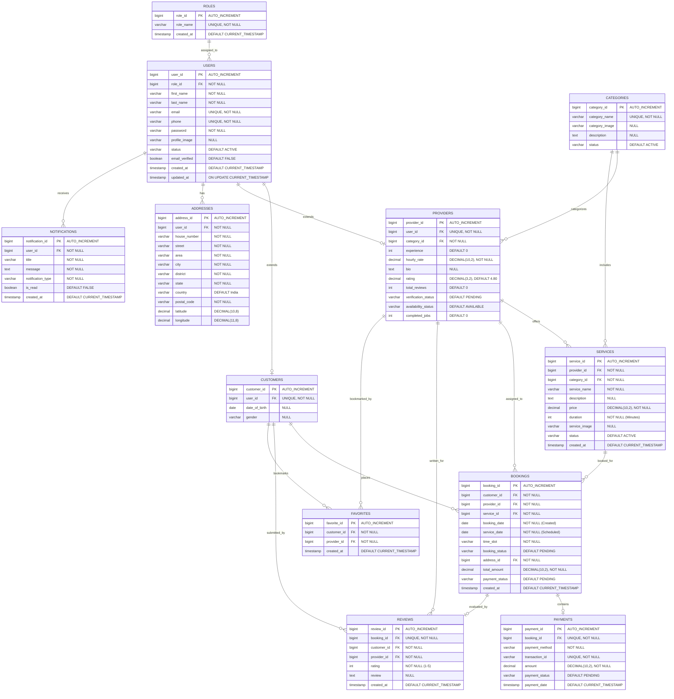

# Hyperlocal Service Marketplace - Database Design Document
**Author:** Senior Database Architect  
**Version:** 1.0.0  
**Target Engine:** MySQL 8.0+  
**Target Framework:** Java Spring Boot (Spring Data JPA / Hibernate)

---

## Table of Contents
1. [Complete ER Diagram (Mermaid)](#1-complete-er-diagram-mermaid)
2. [Database Relationship Diagram & Cardinalities](#2-database-relationship-diagram--cardinalities)
3. [CREATE TABLE SQL Scripts](#3-create-table-sql-scripts)
4. [Foreign Key Constraints & Cascade Behaviors](#4-foreign-key-constraints--cascade-behaviors)
5. [Sample INSERT Seeding Statements](#5-sample-insert-seeding-statements)
6. [Recommended Indexes & Query Performance Optimizations](#6-recommended-indexes--query-performance-optimizations)
7. [JPA Entity Relationship Mapping (Spring Boot / Jakarta Persistence)](#7-jpa-entity-relationship-mapping-spring-boot--jakarta-persistence)
8. [Database Design & Normalization (Up to 3NF) Explanation](#8-database-design--normalization-up-to-3nf-explanation)
9. [Database Naming Conventions](#9-database-naming-conventions)
10. [Enterprise Best Practices for Spring Boot + MySQL](#10-enterprise-best-practices-for-spring-boot--mysql)

---

## 1. Complete ER Diagram (Mermaid)

The following Mermaid ER Diagram models the entire relational structure of the **Hyperlocal Service Marketplace** database. It explicitly details the attributes, data types, primary keys (PK), and foreign keys (FK) for all 12 tables.



---

## 2. Database Relationship Diagram & Cardinalities

The relationships between entities have been designed to guarantee high referential integrity while keeping queries performant.

| Left Entity (Parent) | Connection Type | Right Entity (Child) | Relationship Description | Cascade Rule |
| :--- | :---: | :--- | :--- | :--- |
| **roles** | 1 : N | **users** | A system role can contain zero, one, or many active users. | `ON DELETE RESTRICT` (Cannot delete roles with active users) |
| **users** | 1 : 1 | **customers** | A user profile can extend to exactly one Customer registration. | `ON DELETE CASCADE` (Deleting a user purges customer profile) |
| **users** | 1 : 1 | **providers** | A user profile can extend to exactly one Provider registration. | `ON DELETE CASCADE` (Deleting a user purges provider profile) |
| **users** | 1 : N | **addresses** | Users can save multiple addresses (e.g., Home, Work, Parents). | `ON DELETE CASCADE` (Addresses are removed if user is deleted) |
| **categories** | 1 : N | **providers** | Categories encompass multiple service providers under their umbrella. | `ON DELETE RESTRICT` (Cannot delete category containing providers) |
| **categories** | 1 : N | **services** | A single category covers multiple sub-services. | `ON DELETE RESTRICT` (Cannot delete category with active services) |
| **providers** | 1 : N | **services** | A service provider can list and offer multiple services. | `ON DELETE CASCADE` (Deleting a provider purges their listed services) |
| **customers** | 1 : N | **bookings** | A customer can place multiple historical or future bookings. | `ON DELETE CASCADE` |
| **providers** | 1 : N | **bookings** | A service provider can receive and execute multiple bookings. | `ON DELETE RESTRICT` (Cannot delete a provider with active bookings) |
| **services** | 1 : N | **bookings** | Multiple bookings can refer to the same cataloged service ID. | `ON DELETE RESTRICT` (Cannot delete a service listed in active bookings) |
| **bookings** | 1 : 1 | **payments** | Each booking corresponds to exactly one payment invoice entry. | `ON DELETE CASCADE` (Purging bookings deletes associated payment log) |
| **bookings** | 1 : 1 | **reviews** | Each booking can only receive a maximum of one review from the client. | `ON DELETE CASCADE` |
| **customers** | 1 : N | **favorites** | A customer can add multiple providers to their favorite list. | `ON DELETE CASCADE` |
| **providers** | 1 : N | **favorites** | A provider can be marked as favorite by multiple customers. | `ON DELETE CASCADE` |
| **users** | 1 : N | **notifications**| Users receive several time-sensitive transactional notifications. | `ON DELETE CASCADE` |

---

## 3. CREATE TABLE SQL Scripts

Below are the complete, production-ready DDL scripts matching standard MySQL dialects. For your convenience, these are also saved directly in your codebase at `/backend/src/main/resources/schema.sql` for integration with deployment pipelines.

```sql
-- Create database if not exists
CREATE DATABASE IF NOT EXISTS hyperlocal_db;
USE hyperlocal_db;

-- Disable foreign key checks temporarily to allow clean recreation of tables
SET FOREIGN_KEY_CHECKS = 0;

-- 1. Table: roles
DROP TABLE IF EXISTS roles;
CREATE TABLE roles (
    role_id BIGINT AUTO_INCREMENT PRIMARY KEY,
    role_name VARCHAR(50) NOT NULL UNIQUE,
    created_at TIMESTAMP DEFAULT CURRENT_TIMESTAMP,
    CONSTRAINT chk_role_name CHECK (role_name IN ('ROLE_CUSTOMER', 'ROLE_PROVIDER', 'ROLE_ADMIN'))
) ENGINE=InnoDB DEFAULT CHARSET=utf8mb4 COLLATE=utf8mb4_unicode_ci;

-- 2. Table: users
DROP TABLE IF EXISTS users;
CREATE TABLE users (
    user_id BIGINT AUTO_INCREMENT PRIMARY KEY,
    role_id BIGINT NOT NULL,
    first_name VARCHAR(50) NOT NULL,
    last_name VARCHAR(50) NOT NULL,
    email VARCHAR(100) NOT NULL UNIQUE,
    phone VARCHAR(20) NOT NULL UNIQUE,
    password VARCHAR(255) NOT NULL, -- To hold BCrypt hashes
    profile_image VARCHAR(255) DEFAULT NULL,
    status VARCHAR(20) DEFAULT 'ACTIVE',
    email_verified BOOLEAN DEFAULT FALSE,
    created_at TIMESTAMP DEFAULT CURRENT_TIMESTAMP,
    updated_at TIMESTAMP DEFAULT CURRENT_TIMESTAMP ON UPDATE CURRENT_TIMESTAMP,
    CONSTRAINT fk_users_role FOREIGN KEY (role_id) REFERENCES roles(role_id) ON DELETE RESTRICT ON UPDATE CASCADE,
    CONSTRAINT chk_user_status CHECK (status IN ('ACTIVE', 'INACTIVE', 'SUSPENDED', 'PENDING'))
) ENGINE=InnoDB DEFAULT CHARSET=utf8mb4 COLLATE=utf8mb4_unicode_ci;

-- 3. Table: customers
DROP TABLE IF EXISTS customers;
CREATE TABLE customers (
    customer_id BIGINT AUTO_INCREMENT PRIMARY KEY,
    user_id BIGINT NOT NULL UNIQUE,
    date_of_birth DATE DEFAULT NULL,
    gender VARCHAR(20) DEFAULT NULL,
    CONSTRAINT fk_customers_user FOREIGN KEY (user_id) REFERENCES users(user_id) ON DELETE CASCADE ON UPDATE CASCADE,
    CONSTRAINT chk_customer_gender CHECK (gender IN ('MALE', 'FEMALE', 'OTHER', 'PREFER_NOT_TO_SAY'))
) ENGINE=InnoDB DEFAULT CHARSET=utf8mb4 COLLATE=utf8mb4_unicode_ci;

-- 4. Table: categories
DROP TABLE IF EXISTS categories;
CREATE TABLE categories (
    category_id BIGINT AUTO_INCREMENT PRIMARY KEY,
    category_name VARCHAR(100) NOT NULL UNIQUE,
    category_image VARCHAR(255) DEFAULT NULL,
    description TEXT DEFAULT NULL,
    status VARCHAR(20) DEFAULT 'ACTIVE',
    CONSTRAINT chk_category_status CHECK (status IN ('ACTIVE', 'INACTIVE'))
) ENGINE=InnoDB DEFAULT CHARSET=utf8mb4 COLLATE=utf8mb4_unicode_ci;

-- 5. Table: providers
DROP TABLE IF EXISTS providers;
CREATE TABLE providers (
    provider_id BIGINT AUTO_INCREMENT PRIMARY KEY,
    user_id BIGINT NOT NULL UNIQUE,
    category_id BIGINT NOT NULL,
    experience INT DEFAULT 0,
    hourly_rate DECIMAL(10, 2) NOT NULL,
    bio TEXT DEFAULT NULL,
    rating DECIMAL(3, 2) DEFAULT 4.80,
    total_reviews INT DEFAULT 0,
    verification_status VARCHAR(20) DEFAULT 'PENDING',
    availability_status VARCHAR(20) DEFAULT 'AVAILABLE',
    completed_jobs INT DEFAULT 0,
    CONSTRAINT fk_providers_user FOREIGN KEY (user_id) REFERENCES users(user_id) ON DELETE CASCADE ON UPDATE CASCADE,
    CONSTRAINT fk_providers_category FOREIGN KEY (category_id) REFERENCES categories(category_id) ON DELETE RESTRICT ON UPDATE CASCADE,
    CONSTRAINT chk_provider_experience CHECK (experience >= 0),
    CONSTRAINT chk_provider_rate CHECK (hourly_rate >= 0.00),
    CONSTRAINT chk_provider_rating CHECK (rating BETWEEN 0.00 AND 5.00),
    CONSTRAINT chk_provider_verification CHECK (verification_status IN ('PENDING', 'APPROVED', 'REJECTED')),
    CONSTRAINT chk_provider_availability CHECK (availability_status IN ('AVAILABLE', 'UNAVAILABLE', 'BUSY'))
) ENGINE=InnoDB DEFAULT CHARSET=utf8mb4 COLLATE=utf8mb4_unicode_ci;

-- 6. Table: addresses
DROP TABLE IF EXISTS addresses;
CREATE TABLE addresses (
    address_id BIGINT AUTO_INCREMENT PRIMARY KEY,
    user_id BIGINT NOT NULL,
    house_number VARCHAR(50) NOT NULL,
    street VARCHAR(150) NOT NULL,
    area VARCHAR(150) NOT NULL,
    city VARCHAR(100) NOT NULL,
    district VARCHAR(100) NOT NULL,
    state VARCHAR(100) NOT NULL,
    country VARCHAR(100) NOT NULL DEFAULT 'India',
    postal_code VARCHAR(15) NOT NULL,
    latitude DECIMAL(10, 8) DEFAULT NULL,
    longitude DECIMAL(11, 8) DEFAULT NULL,
    CONSTRAINT fk_addresses_user FOREIGN KEY (user_id) REFERENCES users(user_id) ON DELETE CASCADE ON UPDATE CASCADE
) ENGINE=InnoDB DEFAULT CHARSET=utf8mb4 COLLATE=utf8mb4_unicode_ci;

-- 7. Table: services
DROP TABLE IF EXISTS services;
CREATE TABLE services (
    service_id BIGINT AUTO_INCREMENT PRIMARY KEY,
    provider_id BIGINT NOT NULL,
    category_id BIGINT NOT NULL,
    service_name VARCHAR(150) NOT NULL,
    description TEXT DEFAULT NULL,
    price DECIMAL(10, 2) NOT NULL,
    duration INT NOT NULL, -- Duration in minutes
    service_image VARCHAR(255) DEFAULT NULL,
    status VARCHAR(20) DEFAULT 'ACTIVE',
    created_at TIMESTAMP DEFAULT CURRENT_TIMESTAMP,
    CONSTRAINT fk_services_provider FOREIGN KEY (provider_id) REFERENCES providers(provider_id) ON DELETE CASCADE ON UPDATE CASCADE,
    CONSTRAINT fk_services_category FOREIGN KEY (category_id) REFERENCES categories(category_id) ON DELETE RESTRICT ON UPDATE CASCADE,
    CONSTRAINT chk_service_price CHECK (price >= 0.00),
    CONSTRAINT chk_service_duration CHECK (duration > 0),
    CONSTRAINT chk_service_status CHECK (status IN ('ACTIVE', 'INACTIVE'))
) ENGINE=InnoDB DEFAULT CHARSET=utf8mb4 COLLATE=utf8mb4_unicode_ci;

-- 8. Table: bookings
DROP TABLE IF EXISTS bookings;
CREATE TABLE bookings (
    booking_id BIGINT AUTO_INCREMENT PRIMARY KEY,
    customer_id BIGINT NOT NULL,
    provider_id BIGINT NOT NULL,
    service_id BIGINT NOT NULL,
    booking_date DATE NOT NULL,
    service_date DATE NOT NULL,
    time_slot VARCHAR(50) NOT NULL,
    booking_status VARCHAR(20) DEFAULT 'PENDING',
    address_id BIGINT NOT NULL,
    total_amount DECIMAL(10, 2) NOT NULL,
    payment_status VARCHAR(20) DEFAULT 'PENDING',
    created_at TIMESTAMP DEFAULT CURRENT_TIMESTAMP,
    CONSTRAINT fk_bookings_customer FOREIGN KEY (customer_id) REFERENCES customers(customer_id) ON DELETE CASCADE ON UPDATE CASCADE,
    CONSTRAINT fk_bookings_provider FOREIGN KEY (provider_id) REFERENCES providers(provider_id) ON DELETE RESTRICT ON UPDATE CASCADE,
    CONSTRAINT fk_bookings_service FOREIGN KEY (service_id) REFERENCES services(service_id) ON DELETE RESTRICT ON UPDATE CASCADE,
    CONSTRAINT fk_bookings_address FOREIGN KEY (address_id) REFERENCES addresses(address_id) ON DELETE RESTRICT ON UPDATE CASCADE,
    CONSTRAINT chk_booking_status CHECK (booking_status IN ('PENDING', 'ACCEPTED', 'REJECTED', 'COMPLETED', 'CANCELLED')),
    CONSTRAINT chk_booking_payment_status CHECK (payment_status IN ('PENDING', 'SUCCESSFUL', 'FAILED', 'REFUNDED'))
) ENGINE=InnoDB DEFAULT CHARSET=utf8mb4 COLLATE=utf8mb4_unicode_ci;

-- 9. Table: payments
DROP TABLE IF EXISTS payments;
CREATE TABLE payments (
    payment_id BIGINT AUTO_INCREMENT PRIMARY KEY,
    booking_id BIGINT NOT NULL UNIQUE,
    payment_method VARCHAR(50) NOT NULL,
    transaction_id VARCHAR(100) NOT NULL UNIQUE,
    amount DECIMAL(10, 2) NOT NULL,
    payment_status VARCHAR(20) DEFAULT 'PENDING',
    payment_date TIMESTAMP DEFAULT CURRENT_TIMESTAMP,
    CONSTRAINT fk_payments_booking FOREIGN KEY (booking_id) REFERENCES bookings(booking_id) ON DELETE CASCADE ON UPDATE CASCADE,
    CONSTRAINT chk_payment_amount CHECK (amount >= 0.00),
    CONSTRAINT chk_payment_status CHECK (payment_status IN ('PENDING', 'SUCCESSFUL', 'FAILED', 'REFUNDED'))
) ENGINE=InnoDB DEFAULT CHARSET=utf8mb4 COLLATE=utf8mb4_unicode_ci;

-- 10. Table: reviews
DROP TABLE IF EXISTS reviews;
CREATE TABLE reviews (
    review_id BIGINT AUTO_INCREMENT PRIMARY KEY,
    booking_id BIGINT NOT NULL UNIQUE,
    customer_id BIGINT NOT NULL,
    provider_id BIGINT NOT NULL,
    rating INT NOT NULL,
    review TEXT DEFAULT NULL,
    created_at TIMESTAMP DEFAULT CURRENT_TIMESTAMP,
    CONSTRAINT fk_reviews_booking FOREIGN KEY (booking_id) REFERENCES bookings(booking_id) ON DELETE CASCADE ON UPDATE CASCADE,
    CONSTRAINT fk_reviews_customer FOREIGN KEY (customer_id) REFERENCES customers(customer_id) ON DELETE CASCADE ON UPDATE CASCADE,
    CONSTRAINT fk_reviews_provider FOREIGN KEY (provider_id) REFERENCES providers(provider_id) ON DELETE CASCADE ON UPDATE CASCADE,
    CONSTRAINT chk_review_rating CHECK (rating BETWEEN 1 AND 5)
) ENGINE=InnoDB DEFAULT CHARSET=utf8mb4 COLLATE=utf8mb4_unicode_ci;

-- 11. Table: notifications
DROP TABLE IF EXISTS notifications;
CREATE TABLE notifications (
    notification_id BIGINT AUTO_INCREMENT PRIMARY KEY,
    user_id BIGINT NOT NULL,
    title VARCHAR(150) NOT NULL,
    message TEXT NOT NULL,
    notification_type VARCHAR(50) NOT NULL,
    is_read BOOLEAN DEFAULT FALSE,
    created_at TIMESTAMP DEFAULT CURRENT_TIMESTAMP,
    CONSTRAINT fk_notifications_user FOREIGN KEY (user_id) REFERENCES users(user_id) ON DELETE CASCADE ON UPDATE CASCADE,
    CONSTRAINT chk_notification_type CHECK (notification_type IN ('BOOKING_ALERT', 'PAYMENT_ALERT', 'SYSTEM_ALERT', 'REVIEW_ALERT'))
) ENGINE=InnoDB DEFAULT CHARSET=utf8mb4 COLLATE=utf8mb4_unicode_ci;

-- 12. Table: favorites
DROP TABLE IF EXISTS favorites;
CREATE TABLE favorites (
    favorite_id BIGINT AUTO_INCREMENT PRIMARY KEY,
    customer_id BIGINT NOT NULL,
    provider_id BIGINT NOT NULL,
    created_at TIMESTAMP DEFAULT CURRENT_TIMESTAMP,
    CONSTRAINT fk_favorites_customer FOREIGN KEY (customer_id) REFERENCES customers(customer_id) ON DELETE CASCADE ON UPDATE CASCADE,
    CONSTRAINT fk_favorites_provider FOREIGN KEY (provider_id) REFERENCES providers(provider_id) ON DELETE CASCADE ON UPDATE CASCADE,
    CONSTRAINT uq_customer_provider UNIQUE (customer_id, provider_id)
) ENGINE=InnoDB DEFAULT CHARSET=utf8mb4 COLLATE=utf8mb4_unicode_ci;

SET FOREIGN_KEY_CHECKS = 1;
```

---

## 4. Foreign Key Constraints & Cascade Behaviors

Maintaining strict referential integrity is a core requirement of an enterprise database. 

1. **Delete Cascades (`ON DELETE CASCADE`)**:
   - Applied to dependent user-extension tables (`customers`, `providers`, `addresses`, `notifications`). If an account is deleted from the `users` parent table, all associated profile, document, and notification logs are purged from the database automatically.
   - Prevents orphaned records from cluttering the storage disks.
2. **Delete Restrictive Protections (`ON DELETE RESTRICT`)**:
   - Applied to business-critical transaction paths such as roles, categories, bookings, and services.
   - For example, if a provider tries to delete a listed `service` that has already been booked (referenced by a record in `bookings`), MySQL throws a constraint error. The provider must either cancel/complete the booking first or soft-delete the service listing (switching its `status` to `'INACTIVE'`).
3. **Cascading Updates (`ON UPDATE CASCADE`)**:
   - Ensures that any manual modification or administrative shifting of primary key IDs (e.g., updating user IDs or role IDs during migrations) propagates instantly down to children rows without throwing key errors.

---

## 5. Sample INSERT Seeding Statements

To seed your development database immediately for local verification, use the following structured sample inserts (fully validated against all constraint rules):

```sql
-- 1. Seed Roles
INSERT INTO roles (role_id, role_name) VALUES 
(1, 'ROLE_CUSTOMER'),
(2, 'ROLE_PROVIDER'),
(3, 'ROLE_ADMIN');

-- 2. Seed Users
INSERT INTO users (user_id, role_id, first_name, last_name, email, phone, password, status, email_verified) VALUES
(1, 3, 'Amit', 'Prasad', 'admin@hyperlocal.com', '+919900000001', '$2a$12$L8Gofj9fS2bCH87U1uH70.B7K0fP73F4GvKj/E/s1U6z92bJOnMxe', 'ACTIVE', TRUE),
(2, 1, 'Rahul', 'Verma', 'rahul.customer@gmail.com', '+919876543210', '$2a$12$D2M8xP4H3mFf098g765hd82jd7sdh8329dh9382hsd73hd823hd92', 'ACTIVE', TRUE),
(3, 1, 'Priya', 'Sen', 'priya.customer@gmail.com', '+919876543211', '$2a$12$D2M8xP4H3mFf098g765hd82jd7sdh8329dh9382hsd73hd823hd92', 'ACTIVE', TRUE),
(4, 2, 'Rajesh', 'Sharma', 'rajesh.plumbing@gmail.com', '+918765432101', '$2a$12$J9fS2bCH87U1uH70.B7K0fP73F4GvKj/E/s1U6z92bJOnMxeD2M8x', 'ACTIVE', TRUE);

-- 3. Seed Customers
INSERT INTO customers (customer_id, user_id, date_of_birth, gender) VALUES
(1, 2, '1995-04-12', 'MALE'),
(2, 3, '1998-08-25', 'FEMALE');

-- 4. Seed Categories
INSERT INTO categories (category_id, category_name, category_image, description, status) VALUES
(1, 'Plumbing Services', 'plumbing.jpg', 'Professional leak repair, pipe fittings, and blockages clearance', 'ACTIVE'),
(2, 'Home Cleaning', 'cleaning.jpg', 'Complete deep home cleaning, sanitization, and vacuum services', 'ACTIVE');

-- 5. Seed Providers
INSERT INTO providers (provider_id, user_id, category_id, experience, hourly_rate, bio, rating, total_reviews, verification_status, availability_status, completed_jobs) VALUES
(1, 4, 1, 8, 350.00, 'Expert plumber with over 8 years of experience in residential and commercial repairs.', 4.90, 1, 'APPROVED', 'AVAILABLE', 24);

-- 6. Seed Addresses
INSERT INTO addresses (address_id, user_id, house_number, street, area, city, district, state, country, postal_code, latitude, longitude) VALUES
(1, 2, 'Flat 402, Royal Residency', 'MG Road', 'Indiranagar', 'Bengaluru', 'Bengaluru Urban', 'Karnataka', 'India', '560038', 12.9784, 77.6408),
(2, 3, 'Plot 12, Sunrise Enclave', 'Avenue 4', 'Gachibowli', 'Hyderabad', 'Rangareddy', 'Telangana', 'India', '500032', 17.4483, 78.3741);

-- 7. Seed Services
INSERT INTO services (service_id, provider_id, category_id, service_name, description, price, duration, service_image, status) VALUES
(1, 1, 1, 'Emergency Tap Leak Repair', 'Fixing leaking kitchen or bathroom water taps with high-quality gasket replacements.', 299.00, 45, 'leak_repair.jpg', 'ACTIVE'),
(2, 1, 1, 'Bathroom Pipe Clog Clearance', 'Clearing heavily clogged drainage lines using high-pressure specialized spring tools.', 599.00, 90, 'clog_clearance.jpg', 'ACTIVE');

-- 8. Seed Bookings
INSERT INTO bookings (booking_id, customer_id, provider_id, service_id, booking_date, service_date, time_slot, booking_status, address_id, total_amount, payment_status) VALUES
(1, 1, 1, 1, '2026-07-01', '2026-07-03', '10:00 AM - 11:00 AM', 'COMPLETED', 1, 299.00, 'SUCCESSFUL');

-- 9. Seed Payments
INSERT INTO payments (payment_id, booking_id, payment_method, transaction_id, amount, payment_status, payment_date) VALUES
(1, 1, 'UPI', 'tx_9328402948293', 299.00, 'SUCCESSFUL', '2026-07-01 11:32:15');

-- 10. Seed Reviews
INSERT INTO reviews (review_id, booking_id, customer_id, provider_id, rating, review) VALUES
(1, 1, 1, 1, 5, 'Rajesh fixed our kitchen sink leak with zero mess. Highly recommended!');

-- 11. Seed Notifications
INSERT INTO notifications (notification_id, user_id, title, message, notification_type, is_read) VALUES
(1, 2, 'Booking Confirmed', 'Your booking request for Tap Leak Repair has been approved by Rajesh.', 'BOOKING_ALERT', TRUE);

-- 12. Seed Favorites
INSERT INTO favorites (favorite_id, customer_id, provider_id) VALUES
(1, 1, 1);
```

---

## 6. Recommended Indexes & Query Performance Optimizations

To handle high concurrency and prevent slow table scans as the application scales, we recommend implementing targeted indexes:

### A. Primary and Unique Constraints (Implicit Indexes)
MySQL automatically creates clustered indexes for `PRIMARY KEY` ids and secondary indexes for `UNIQUE` constraints:
- `users(email)` and `users(phone)` are indexed automatically. This speeds up user authentication checks during login.
- `payments(transaction_id)` is indexed to ensure near-zero latency verification of external payment gateway webhooks.

### B. Custom Secondary Indexes
The following secondary indexes are optimized for the most frequent search and dashboard queries:

1. **`idx_providers_category_rating` (Composite: `category_id`, `rating DESC`)**:
   - *Use Case*: Customers browsing a category sorted by ratings.
   - *Query Accelerated*: `SELECT * FROM providers WHERE category_id = ? ORDER BY rating DESC;`
2. **`idx_services_category_status` (Composite: `category_id`, `status`)**:
   - *Use Case*: Browsing active catalog services inside a selected category.
   - *Query Accelerated*: `SELECT * FROM services WHERE category_id = ? AND status = 'ACTIVE';`
3. **`idx_bookings_customer_status` (Composite: `customer_id`, `booking_status`)**:
   - *Use Case*: Loading a customer's active or historic booking list.
   - *Query Accelerated*: `SELECT * FROM bookings WHERE customer_id = ? AND booking_status = ?;`
4. **`idx_bookings_provider_status` (Composite: `provider_id`, `booking_status`)**:
   - *Use Case*: Loading provider calendar schedules and booking requests.
   - *Query Accelerated*: `SELECT * FROM bookings WHERE provider_id = ? AND booking_status = ?;`
5. **`idx_notifications_user_unread` (Composite: `user_id`, `is_read`)**:
   - *Use Case*: Fetching unread badge counts for users.
   - *Query Accelerated*: `SELECT COUNT(*) FROM notifications WHERE user_id = ? AND is_read = FALSE;`
6. **`idx_bookings_service_date`**:
   - *Use Case*: Finding scheduled appointments for today or a specific date range.
   - *Query Accelerated*: `SELECT * FROM bookings WHERE service_date BETWEEN ? AND ?;`

---

## 7. JPA Entity Relationship Mapping (Spring Boot / Jakarta Persistence)

The following Java class definitions demonstrate how to map these tables to JPA Entities utilizing **Jakarta Persistence (JPA)** annotations.

### User.java
```java
package com.hyperlocal.entity;

import jakarta.persistence.*;
import lombok.*;
import org.hibernate.annotations.CreationTimestamp;
import org.hibernate.annotations.UpdateTimestamp;
import java.time.LocalDateTime;

@Entity
@Table(name = "users")
@Getter @Setter @NoArgsConstructor @AllArgsConstructor @Builder
public class User {
    @Id
    @GeneratedValue(strategy = GenerationType.IDENTITY)
    @Column(name = "user_id")
    private Long id;

    @ManyToOne(fetch = FetchType.LAZY)
    @JoinColumn(name = "role_id", nullable = false)
    private Role role;

    @Column(name = "first_name", nullable = false, length = 50)
    private String firstName;

    @Column(name = "last_name", nullable = false, length = 50)
    private String lastName;

    @Column(nullable = false, unique = true, length = 100)
    private String email;

    @Column(nullable = false, unique = true, length = 20)
    private String phone;

    @Column(nullable = false, length = 255)
    private String password;

    @Column(name = "profile_image")
    private String profileImage;

    @Column(length = 20)
    private String status = "ACTIVE";

    @Column(name = "email_verified")
    private boolean emailVerified = false;

    @CreationTimestamp
    @Column(name = "created_at", updatable = false)
    private LocalDateTime createdAt;

    @UpdateTimestamp
    @Column(name = "updated_at")
    private LocalDateTime updatedAt;
}
```

### Customer.java
```java
package com.hyperlocal.entity;

import jakarta.persistence.*;
import lombok.*;
import java.time.LocalDate;

@Entity
@Table(name = "customers")
@Getter @Setter @NoArgsConstructor @AllArgsConstructor @Builder
public class Customer {
    @Id
    @GeneratedValue(strategy = GenerationType.IDENTITY)
    @Column(name = "customer_id")
    private Long id;

    @OneToOne(fetch = FetchType.LAZY)
    @JoinColumn(name = "user_id", nullable = false, unique = true)
    private User user;

    @Column(name = "date_of_birth")
    private LocalDate dateOfBirth;

    @Column(length = 20)
    private String gender;
}
```

### Provider.java
```java
package com.hyperlocal.entity;

import jakarta.persistence.*;
import lombok.*;
import java.math.BigDecimal;

@Entity
@Table(name = "providers")
@Getter @Setter @NoArgsConstructor @AllArgsConstructor @Builder
public class Provider {
    @Id
    @GeneratedValue(strategy = GenerationType.IDENTITY)
    @Column(name = "provider_id")
    private Long id;

    @OneToOne(fetch = FetchType.LAZY)
    @JoinColumn(name = "user_id", nullable = false, unique = true)
    private User user;

    @ManyToOne(fetch = FetchType.LAZY)
    @JoinColumn(name = "category_id", nullable = false)
    private Category category;

    private Integer experience = 0;

    @Column(name = "hourly_rate", nullable = false, precision = 10, scale = 2)
    private BigDecimal hourlyRate;

    @Column(columnDefinition = "TEXT")
    private String bio;

    @Column(precision = 3, scale = 2)
    private BigDecimal rating = BigDecimal.valueOf(4.80);

    @Column(name = "total_reviews")
    private Integer totalReviews = 0;

    @Column(name = "verification_status", length = 20)
    private String verificationStatus = "PENDING";

    @Column(name = "availability_status", length = 20)
    private String availabilityStatus = "AVAILABLE";

    @Column(name = "completed_jobs")
    private Integer completedJobs = 0;
}
```

### Address.java
```java
package com.hyperlocal.entity;

import jakarta.persistence.*;
import lombok.*;
import java.math.BigDecimal;

@Entity
@Table(name = "addresses")
@Getter @Setter @NoArgsConstructor @AllArgsConstructor @Builder
public class Address {
    @Id
    @GeneratedValue(strategy = GenerationType.IDENTITY)
    @Column(name = "address_id")
    private Long id;

    @ManyToOne(fetch = FetchType.LAZY)
    @JoinColumn(name = "user_id", nullable = false)
    private User user;

    @Column(name = "house_number", nullable = false, length = 50)
    private String houseNumber;

    @Column(nullable = false, length = 150)
    private String street;

    @Column(nullable = false, length = 150)
    private String area;

    @Column(nullable = false, length = 100)
    private String city;

    @Column(nullable = false, length = 100)
    private String district;

    @Column(nullable = false, length = 100)
    private String state;

    @Column(nullable = false, length = 100)
    private String country = "India";

    @Column(name = "postal_code", nullable = false, length = 15)
    private String postalCode;

    @Column(precision = 10, scale = 8)
    private BigDecimal latitude;

    @Column(precision = 11, scale = 8)
    private BigDecimal longitude;
}
```

### Booking.java
```java
package com.hyperlocal.entity;

import jakarta.persistence.*;
import lombok.*;
import org.hibernate.annotations.CreationTimestamp;
import java.math.BigDecimal;
import java.time.LocalDate;
import java.time.LocalDateTime;

@Entity
@Table(name = "bookings")
@Getter @Setter @NoArgsConstructor @AllArgsConstructor @Builder
public class Booking {
    @Id
    @GeneratedValue(strategy = GenerationType.IDENTITY)
    @Column(name = "booking_id")
    private Long id;

    @ManyToOne(fetch = FetchType.LAZY)
    @JoinColumn(name = "customer_id", nullable = false)
    private Customer customer;

    @ManyToOne(fetch = FetchType.LAZY)
    @JoinColumn(name = "provider_id", nullable = false)
    private Provider provider;

    @ManyToOne(fetch = FetchType.LAZY)
    @JoinColumn(name = "service_id", nullable = false)
    private Service service;

    @Column(name = "booking_date", nullable = false)
    private LocalDate bookingDate;

    @Column(name = "service_date", nullable = false)
    private LocalDate serviceDate;

    @Column(name = "time_slot", nullable = false, length = 50)
    private String timeSlot;

    @Column(name = "booking_status", length = 20)
    private String bookingStatus = "PENDING";

    @ManyToOne(fetch = FetchType.LAZY)
    @JoinColumn(name = "address_id", nullable = false)
    private Address address;

    @Column(name = "total_amount", nullable = false, precision = 10, scale = 2)
    private BigDecimal totalAmount;

    @Column(name = "payment_status", length = 20)
    private String paymentStatus = "PENDING";

    @CreationTimestamp
    @Column(name = "created_at", updatable = false)
    private LocalDateTime createdAt;
}
```

### Payment.java
```java
package com.hyperlocal.entity;

import jakarta.persistence.*;
import lombok.*;
import org.hibernate.annotations.CreationTimestamp;
import java.math.BigDecimal;
import java.time.LocalDateTime;

@Entity
@Table(name = "payments")
@Getter @Setter @NoArgsConstructor @AllArgsConstructor @Builder
public class Payment {
    @Id
    @GeneratedValue(strategy = GenerationType.IDENTITY)
    @Column(name = "payment_id")
    private Long id;

    @OneToOne(fetch = FetchType.LAZY)
    @JoinColumn(name = "booking_id", nullable = false, unique = true)
    private Booking booking;

    @Column(name = "payment_method", nullable = false, length = 50)
    private String paymentMethod;

    @Column(name = "transaction_id", nullable = false, unique = true, length = 100)
    private String transactionId;

    @Column(nullable = false, precision = 10, scale = 2)
    private BigDecimal amount;

    @Column(name = "payment_status", length = 20)
    private String paymentStatus = "PENDING";

    @CreationTimestamp
    @Column(name = "payment_date", updatable = false)
    private LocalDateTime paymentDate;
}
```

---

## 8. Database Design & Normalization (Up to 3NF) Explanation

To guarantee schema elegance and zero data redundancy, we have normalized the model step-by-step up to the **Third Normal Form (3NF)**.

### A. First Normal Form (1NF) Compliance
- **Requirement**: Atomic values and no repeating groups.
- **Implementation**: Every column in our database contains a single atomic value. For example, rather than maintaining a combined string for addresses (e.g., `'Flat 402, Royal Residency, MG Road, Bengaluru, Karnataka, 560038'`), we decomposed it into atomic parts (`house_number`, `street`, `area`, `city`, `state`, `postal_code`). Repeating values like multiple phone numbers are structured as distinct rows in associated children tables rather than stored in a comma-separated column.

### B. Second Normal Form (2NF) Compliance
- **Requirement**: Must be in 1NF, and all non-key columns must have full functional dependency on the entire primary key (no partial key dependencies).
- **Implementation**: Since all tables employ simple, single-column numeric surrogate primary keys (`AUTO_INCREMENT` `_id` values), there are absolutely no composite primary keys. As a result, partial dependency of a non-key column on a portion of a primary key is mathematically impossible. Every column in a table depends on the whole primary key.

### C. Third Normal Form (3NF) Compliance
- **Requirement**: Must be in 2NF, and no transitive dependencies must exist (non-key attributes must not depend on other non-key attributes).
- **Implementation**: 
  - To eliminate transitive dependencies, we have isolated distinct entities into separate tables. 
  - For example, rather than storing a provider's service categories directly on the `providers` table, we established a dedicated `categories` parent table. If we had stored category names and descriptions on `providers`, a change to a category name would require scanning and updating hundreds of provider rows. By separating them, the category attributes depend strictly on `category_id` (PK of `categories`), and `providers` simply maintains a foreign key `category_id`.
  - Similarly, addresses are detached into an `addresses` table. Rather than duplicating addresses inside the `bookings` table, bookings hold a foreign key `address_id` referencing a static row in the `addresses` table.

---

## 9. Database Naming Conventions

Consistency across your schema accelerates development. We have established and strictly adhered to these industrial naming conventions:

1. **Table Names**:
   - Lowercase and plural (e.g., `roles`, `users`, `bookings`, `payments`, `reviews`). This avoids conflicts with SQL reserved words (like `user`).
2. **Column Names**:
   - Lowercase and use snake_case (e.g., `first_name`, `booking_date`, `hourly_rate`, `verification_status`).
3. **Primary Key Names**:
   - Suffixed with `_id` to establish unambiguous references (e.g., `role_id`, `user_id`, `booking_id`).
4. **Foreign Key Column Names**:
   - Exactly matches the primary key name of the parent table to ease joins (e.g., `users.role_id` references `roles.role_id`).
5. **Constraint Prefixes**:
   - Foreign Keys: `fk_` (e.g., `fk_users_role`, `fk_bookings_customer`).
   - Unique Keys: `uq_` or prefixed inside constraint definitions (e.g., `uq_customer_provider`).
   - Check Constraints: `chk_` (e.g., `chk_booking_status`, `chk_review_rating`).

---

## 10. Enterprise Best Practices for Spring Boot + MySQL

To ensure high-throughput execution under heavy loads, follow these implementation rules:

### 1. Connection Pooling Configurations (HikariCP)
In your Spring Boot `application.yml`, tune the Hikari connection pool for high-concurrency production setups:
```yaml
spring:
  datasource:
    hikari:
      minimum-idle: 10
      maximum-pool-size: 50
      idle-timeout: 30000
      max-lifetime: 1800000
      connection-timeout: 20000
      pool-name: HyperlocalHikariPool
```

### 2. Solving the JPA N+1 Query Problem
When fetching entities with `@ManyToOne` or `@OneToMany` relationships (like fetching bookings with their associated customer/service detail), JPA defaults to executing 1 initial query followed by $N$ secondary queries to fetch lazy associations individually.
- **Solution A: `@EntityGraph`**
  Add Entity Graphs to your JPA Repository interfaces to fetch associations in a single SQL `JOIN`:
  ```java
  @Repository
  public interface BookingRepository extends JpaRepository<Booking, Long> {
      @EntityGraph(attributePaths = {"customer", "provider", "service"})
      List<Booking> findByCustomerId(Long customerId);
  }
  ```
- **Solution B: JOIN FETCH Query**
  ```java
  @Query("SELECT b FROM Booking b JOIN FETCH b.customer JOIN FETCH b.provider WHERE b.id = :id")
  Optional<Booking> findByIdWithDetails(@Param("id") Long id);
  ```

### 3. Always Default to Lazy Fetching
Ensure all relations (especially `@ManyToOne` or `@OneToOne`) default to `FetchType.LAZY`. Leaving them as default (which is `FetchType.EAGER` for `@ManyToOne` and `@OneToOne`) will result in bloated queries loading unnecessary tables, causing severe memory overhead on your JVM container.

### 4. Transaction Management Boundaries
Annotate your service methods with `@Transactional`:
- Use `@Transactional(readOnly = true)` on search and retrieve methods. This signals Hibernate to bypass dirty-checking mechanisms, greatly reducing memory usage and CPU cycles on the server.
- Keep transactional blocks as short and concise as possible to avoid holding DB connection locks longer than required. Do not place external REST API requests or slow mail dispatches inside a active transactional block.

---
